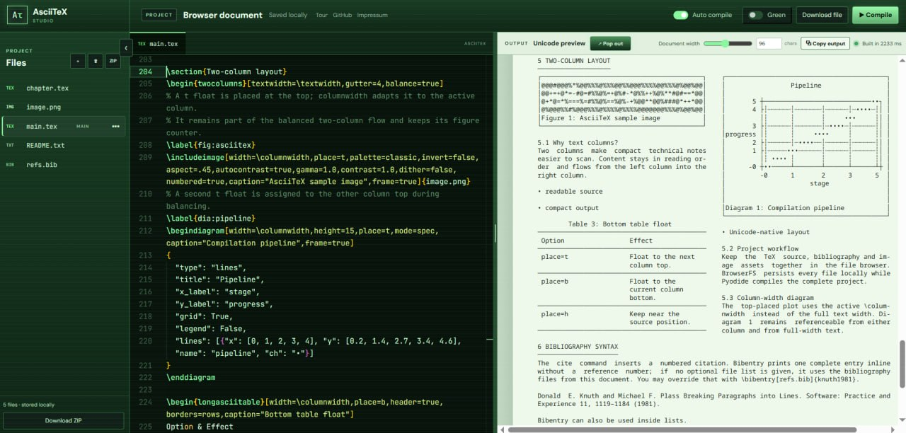
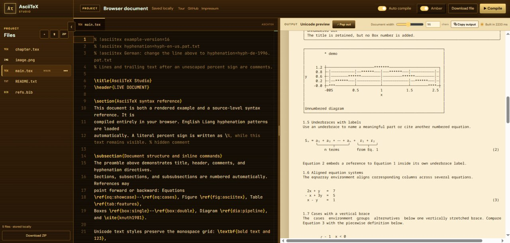

# AsciiTeX Studio — Browser Edition

[](https://github.com/thomasliebig/asciitexstudio/actions/workflows/pages.yml)

Write TeX-like documents and instantly render them as clean monospaced Unicode — directly in your browser, with no server-side document upload.

## Try it online

👉 **Open AsciiTeX Studio:** <https://thomasliebig.github.io/asciitexstudio/>

AsciiTeX Studio feels a bit like a tiny, Unicode-native Overleaf: file browser on the left, Monaco source editor in the middle, live rendered output on the right. It runs the Python AsciiTeX compiler locally through Pyodide and stores your project files in the browser.

<table>
  <tr>
    <td width="50%">
      <a href="https://thomasliebig.github.io/asciitexstudio/">
        
      </a>
    </td>
    <td width="50%">
      <a href="https://thomasliebig.github.io/asciitexstudio/">
        
      </a>
    </td>
  </tr>
</table>

## What makes it fun

- Edit `.tex`, BibTeX, images and supporting files in a browser project.
- Compile automatically while typing, or switch to manual compile.
- Preview Unicode output in a document-like pane with adjustable width.
- Use AsciiTeX features for math, figures, diagrams, tables, boxes, bibliography and cross-references.
- Keep everything local-first: files persist in BrowserFS/IndexedDB.
- Install it as a Progressive Web App for a small desktop-like writing tool.
- Pop out the live preview for a second monitor.
- Use green or amber retro themes, because terminal nostalgia deserves options.

## Feature overview

- Monaco editor with AsciiTeX syntax highlighting
- live or manual compilation to monospaced Unicode output
- project browser for `.tex`, BibTeX, images and supporting files
- drag-and-drop file upload
- download individual files or the whole project as ZIP
- re-import exported ZIP projects, including project folders and nested assets
- two-way navigation between source and rendered output
- adjustable editor/output split and document width
- local-first project persistence in IndexedDB
- installable Progressive Web App
- images, diagrams, tables, boxes, mathematics, bibliography and cross-references
- wrapped `longasciitable` tables with configurable border placement and glyph styles
- modular TeX documents through recursive `\input{...}` and `\include{...}`
- numbered and unnumbered sections, equations, figures, diagrams, tables and boxes

## Architecture

1. Vue and Vite provide the application shell and user interface.
2. BrowserFS exposes an in-browser project filesystem backed by IndexedDB.
3. A Web Worker loads Pyodide and the Python AsciiTeX engine.
4. The worker mounts the current project, compiles `main.tex`, and returns Unicode output.
5. Monaco edits source files while the preview displays the compiler result.

All compilation happens locally in the browser. No document upload is required by the application itself.

AsciiTeX Studio develops the original [AsciiTeX](https://github.com/thomasliebig/AsciiTeX) project into a browser-based editing and compilation environment. The web application was developed with the assistance of a coding agent: the agent helped analyse and extend the existing AsciiTeX codebase, implement the Vue interface, integrate Pyodide and BrowserFS, and build browser-oriented workflows. The resulting source remains intended for human review and maintenance.

## Development

```sh
npm install
npm run dev
```

Create a production build with:

```sh
npm run build
```

The generated site is written to `dist/`. Progressive Web App installation requires HTTPS in production; localhost is accepted during development.

For Chrome DevTools snippets that inspect BrowserFS files, cache entries, access timestamps, and cache hits, see [Cache and BrowserFS debugging](docs/CACHE_AND_BROWSERFS_DEBUGGING.md).

For notes on extending AsciiTeX with new commands, environments, floats and renderers, see [Extending AsciiTeX Studio](docs/EXTENDING_ASCIITEX.md).

## Starter project files

The initial BrowserFS project is seeded from files in `public/seed/`. To customize the files that a fresh installation receives, edit:

- `public/seed/manifest.json` for the list of files and their target BrowserFS paths
- `public/seed/main.tex`, `chapter.tex`, `refs.bib`, and `README.txt` for text content
- any public asset referenced by the manifest, for example `public/examples/image.png`

Seed files are installed only when the browser project filesystem is empty. Existing local projects are never overwritten on reload.

## Relationship to AsciiTeX

This directory contains the browser application around AsciiTeX. Python engine files served to Pyodide live in `public/python/` and mirror the corresponding compiler sources in the parent project. When changing the engine, keep both copies synchronized and increment the engine version used by the worker so browsers do not retain stale code.

See the parent project’s license and third-party notices before redistribution.

## Website and source

- Website: <https://thomasliebig.github.io/asciitexstudio/>
- Source: <https://github.com/thomasliebig/asciitexstudio>
- Imprint: <https://tapekuna.ai/#impressum>
